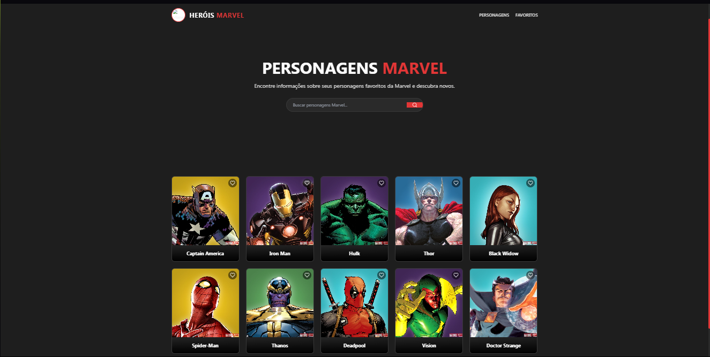
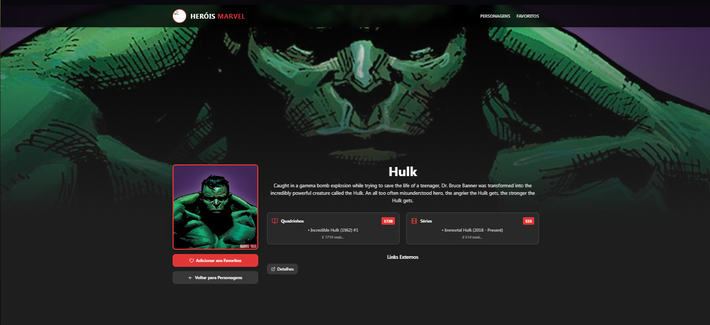

# Marvel Heroes App 🦸‍♂️

## 📝 Sobre o Projeto

Este projeto é uma aplicação web desenvolvida em React que consome a API da Marvel para exibir informações sobre personagens do universo Marvel. A aplicação permite visualizar personagens, pesquisar por nome, ver detalhes específicos e gerenciar uma lista de favoritos.


## 🚀 Funcionalidades

- **Lista de Personagens**: Visualize todos os personagens da Marvel com paginação
- **Pesquisa**: Busque personagens específicos pelo nome
- **Detalhes**: Acesse informações detalhadas de cada personagem
- **Favoritos**: Adicione e remova personagens da sua lista de favoritos
- **Rotas Dinâmicas**: Navegação entre páginas usando React Router

## 🛠️ Tecnologias Utilizadas

- React 18 com TypeScript
- Vite (bundler)
- React Router DOM (rotas)
- TanStack Query (gerenciamento de estado e cache)
- Tailwind CSS (estilização)
- Shadcn/UI (componentes)
- Lucide React (ícones)
- API Marvel Comics

## ⚙️ Como Executar o Projeto

### Pré-requisitos
- Node.js instalado (versão 16 ou superior)
- NPM ou Yarn

### Instalação

1. Clone o repositório:
```bash
git clone [URL_DO_SEU_REPOSITÓRIO]
```

2. Entre no diretório do projeto:
```bash
cd marvel-heroes
```

3. Instale as dependências:
```bash
npm install
```

4. Configure as variáveis de ambiente:
Crie um arquivo `.env` na raiz do projeto e adicione suas chaves da API Marvel:
```env
VITE_MARVEL_PUBLIC_KEY=sua_chave_publica_aqui
VITE_MARVEL_PRIVATE_KEY=sua_chave_privada_aqui
```

5. Inicie o servidor de desenvolvimento:
```bash
npm run dev
```

O projeto estará disponível em `http://localhost:5173`

## 📱 Rotas da Aplicação

- `/` - Página inicial com lista de personagens
- `/character/:id` - Página de detalhes do personagem
- `/favorites` - Página de personagens favoritos
- `*` - Página 404 para rotas não encontradas

## 🌐 Deploy

A aplicação está disponível online em: [URL_DO_SEU_DEPLOY]

## 📸 Screenshots

### Página Inicial



### Detalhes do Personagem



### Favoritos


## ✨ Créditos

Desenvolvido por Gabriel Storti Segalla

Dados fornecidos pela [Marvel Comics API](https://developer.marvel.com).

